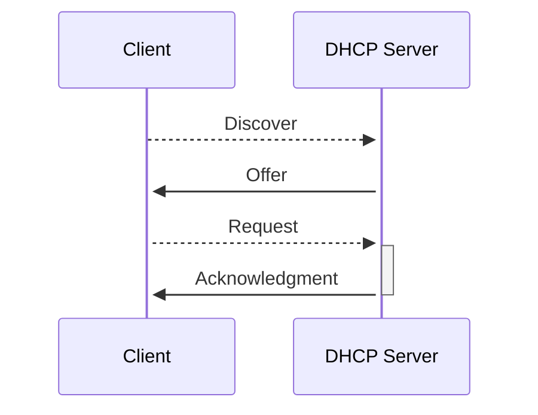

| Begriff                       | Erklärung                                                                     |
| ----------------------------- | ----------------------------------------------------------------------------- |
| **DHCP**                      | Dynamic Host Configuration Protocol – Weist IP-Adressen automatisch zu.       |
| **BOOTP**                     | Vorgänger von DHCP, statische IP-Zuweisung.                                   |
| **RARP**                      | Reverse Address Resolution Protocol – Wandelt MAC-Adressen in IP-Adressen um. |
| **NTP**                       | Network Time Protocol – Synchronisiert Uhren in Netzwerken.                   |
| **Lease Time**                | Dauer, für die eine IP-Adresse an einen Client vergeben wird.                 |
| **DNS Server**                | Wandelt Domainnamen in IP-Adressen um.                                        |
| **DHCP Discover**             | Broadcast-Anfrage eines Clients nach einem DHCP-Server.                       |
| **DHCP Offer**                | Antwort des DHCP-Servers mit einer angebotenen IP-Adresse.                    |
| **DHCP Request**              | Client fordert die angebotene IP-Adresse an.                                  |
| **DHCP ACK**                  | Bestätigung der IP-Adresszuweisung durch den DHCP-Server.                     |
| **WLAN 6**                    | IEEE 802.11ax – Höhere Geschwindigkeit, bessere Effizienz.                    |
| **WPA2**                      | Sicherheitsprotokoll mit AES-Verschlüsselung.                                 |
| **WPA3**                      | Verbesserte Verschlüsselung, Schutz gegen Brute-Force-Angriffe.               |
| **WPS**                       | Wi-Fi Protected Setup – Vereinfachte Verbindung ohne Passwort. Unsicher!      |
| **Radius**                    | Authentifizierungsserver für WPA2 Enterprise.                                 |
| **Hotspot 2.0**               | Automatische WLAN-Verbindung mit Roaming-Funktion.                            |
| **SSID**                      | Name des WLAN-Netzwerks.                                                      |
| **Authentifizierung**         | Identitätsprüfung beim Verbindungsaufbau.                                     |
| **Wave 2**                    | Erweiterung von WLAN 802.11ac – Mehr Benutzer gleichzeitig.                   |
| **Band Steering**             | Automatische Auswahl des besten Frequenzbands.                                |
| **MIMO-Technik**              | Mehrere Antennen für bessere Leistung.                                        |
| **Basisstationen**            | Access Points oder Router für WLAN-Abdeckung.                                 |
| **AP**                        | Access Point – Verbindet drahtlose Geräte mit dem Netzwerk.                   |
| **AES**                       | Verschlüsselungsalgorithmus für sichere Datenübertragung.                     |
| **CCMP**                      | Verschlüsselungsmethode in WPA2, sicherer als TKIP.                           |
| **WDS**                       | Wireless Distribution System – Erweitert WLAN ohne Kabel.                     |
| **Ad-hoc-Netzwerk (IBSS)**    | Geräte kommunizieren direkt miteinander ohne AP.                              |
| **Infrastruktur-Modus (BSS)** | Geräte verbinden sich über einen Access Point.                                |
| **Wireless Bridging (ESS)**   | Mehrere APs bilden ein erweitertes WLAN.                                      |

## DHCP-Client Anfrage an Server
- **Discover (Entdecken)**: Client sendet Broadcast
- **Offer (Angebot)**: DHCP-Server antwortet
- **Request (Nachfrage)**: Client fordert IP-Adresse an
- **ACK (Bestätigung)**: DHCP-Server bestätigt

## Wichtige DHCP-Parameter
| Parameter        | Definition                                                                                       |
| ---------------- | ------------------------------------------------------------------------------------------------ |
| IP-Adresse       | Eindeutige Adresse eines Geräts in einem Netzwerk.                                               |
| Subnetzmaske     | Definiert den **Netzwerk**- und _Hostanteil_ einer IP-Adresse. Beispiel: **192.168**._150.33_ |
| Standard-Gateway | Router-Adresse für den Zugriff auf andere Netzwerke.                                             |
| DNS-Server       | Übersetzt Domainnamen in IP-Adressen.                                                            |
| Lease Time       | Dauer, für die eine IP-Adresse per DHCP zugewiesen wird.                                         |

## WLAN-Topologien
- **Ad-hoc**: Direkte Kommunikation
- **Infrastruktur**: Kommunikation über AP
- **Mesh-Netzwerk**: Mehrere APs mit selbstorganisierender Verbindung

## DHCP Vor- und Nachteile
**Vorteile**:
- Automatische IP-Vergabe
- Weniger Fehler
**Nachteile**:
- Abhängigkeit vom Server
- IP-Wechsel möglich

## WPA2 vs. WPA3
- **WPA2 Personal**: Passwortbasiert
- **WPA2 Enterprise**: Radius-Server
- **WPA3**: Stärkere Verschlüsselung

## WLAN-Frameaufbau nach IEEE 802.11
- **MAC-Header**
- **Frame-Control**
- **Adresse 1-4**
- **Daten**
- **FCS (Prüfsumme)**

## Maximale Reichweite
- **2,4 GHz**: Höhere Reichweite
- **5 GHz**: Kürzere Reichweite, höhere Geschwindigkeit
- **6 GHz**: Schnell, aber geringe Reichweite

## WLAN-Authentifizierungsverfahren
- Open System (unsicher)
- WEP (veraltet)
- WPA/WPA2 (Personal/Enterprise)
- WPA3 (sicherste Variante)

## Maximale WLAN-Reichweite
- Gebäude: ~30m (2,4 GHz), ~10m (5 GHz)
- Außen: ~100m (2,4 GHz), ~50m (5 GHz)

## Empfehlung für WLAN-Schlüssel
- **Mindestens 16 Zeichen**
- **Mix aus Zahlen, Buchstaben, Sonderzeichen**
- **Kein Wörterbuchwort**

## IEEE 802.11 Standards
- **802.11b** (langsam, 2,4 GHz)
- **802.11g** (besser, 2,4 GHz)
- **802.11n** (MIMO, 2,4 & 5 GHz)
- **802.11ac** (schneller, 5 GHz)
- **802.11ax (Wi-Fi 6)** (beste Performance)

## WLAN-Frequenzen
- **2,4 GHz**: Bessere Reichweite, Störungen durch andere Geräte
- **5 GHz**: Weniger Störungen, höhere Geschwindigkeit
- **6 GHz**: Zukunftstechnologie, hohe Bandbreite

## Ursachen für geringe Netto-Übertragungsrate
- Interferenzen
- Entfernung zum AP
- Anzahl der Geräte
- MIMO-Nutzung

## Mesh-Netzwerk & WLAN Roaming
- **Mesh**: Automatische Weiterleitung zwischen APs
- **Roaming**: Automatischer Wechsel zwischen APs
