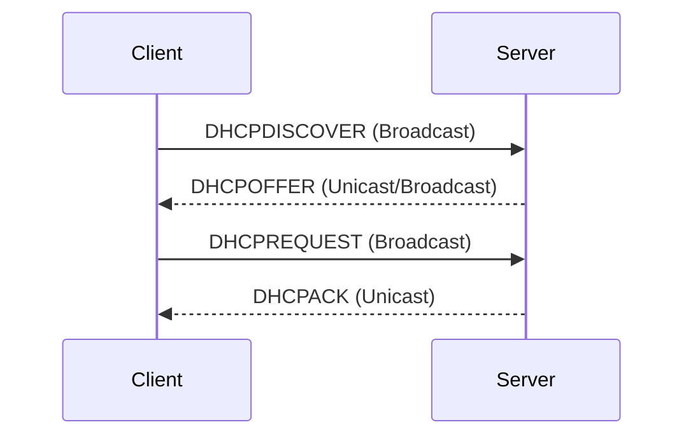

## Einführung in DHCPv4
DHCPv4 ermöglicht es Netzwerken, IPv4-Adressen und andere Netzwerk-Konfigurationsinformationen dynamisch zuzuweisen. Es erleichtert Administratoren die Verwaltung von Netzwerken, indem es die Notwendigkeit reduziert, IP-Adressen manuell zu konfigurieren.

### Eigenschaften von DHCPv4:
- **Automatische Zuweisung:** DHCPv4 weist IPv4-Adressen aus einem definierten Adresspool zu.
- **Lease Time:** Die IP-Adressen werden für einen bestimmten Zeitraum zugewiesen und müssen bei Bedarf erneuert werden.
- **Skalierbarkeit:** DHCPv4 ist für kleine bis mittlere Netzwerke geeignet.

---

## Ablauf des DHCP-Prozesses (DORA-Prinzip)
Der DHCPv4-Prozess läuft in vier Schritten ab:

### 1. DHCP Discover
- Der Client sendet eine **DHCPDISCOVER**-Nachricht per Broadcast, um verfügbare DHCP-Server zu finden.
- Zweck: Suche nach einem DHCPv4-Server.

### 2. DHCP Offer
- Der Server antwortet mit einer **DHCPOFFER**-Nachricht.
- Inhalt: Eine freie IPv4-Adresse und andere Konfigurationsdetails (Subnetzmaske, Gateway, DNS).

### 3. DHCP Request
- Der Client sendet eine **DHCPREQUEST**-Nachricht, um die angebotene Adresse anzufordern.
- Zweck: Auswahl eines Servers und Bestätigung der Adressanfrage.

### 4. DHCP Acknowledge
- Der Server bestätigt die Anfrage mit einer **DHCPACK**-Nachricht.
- Ergebnis: Der Client erhält die IP-Adresse und andere Netzwerkinformationen.

---

## Beispiel für eine Netzwerkadresse:
| Parameter                          | Beispielwert          |
|------------------------------------|-----------------------|
| **Netzwerk-Adresse (Netz-ID):**    | 192.168.1.0           |
| **Netzmaske:**                     | 255.255.255.0 (/24)   |
| **Gateway-Adresse:**               | 192.168.1.1           |
| **DNS-Server:**                    | 8.8.8.8               |
| **DHCP-Server-Adresse:**           | 192.168.1.2           |
| **Bereich für dynamische Adressen:** | 192.168.1.100–192.168.1.200 |
| **Lease Time:**                    | 24 Stunden            |

---

## Vorteile von DHCPv4:
1. **Automatisierung:** Reduziert den Aufwand für die manuelle Konfiguration.
2. **Fehlerminimierung:** Verhindert Adresskonflikte und Konfigurationsfehler.
3. **Effizienz:** Dynamische Wiederverwendung ungenutzter Adressen.

## Nachteile von DHCPv4:
1. **Abhängigkeit vom Server:** Wenn der DHCP-Server ausfällt, können keine neuen Adressen zugewiesen werden.
2. **Sicherheitsrisiken:** Unerwünschte Geräte könnten IP-Adressen erhalten.

---

## Ablaufdiagramm (DORA):

---

## Begriffe und Erklärungen:
- **Broadcast:** Nachricht an alle Geräte im Netzwerk.
- **Unicast:** Nachricht an ein spezifisches Gerät.
- **Lease:** Zeitraum, für den eine IP-Adresse zugewiesen wird.

---

## Vorbereitung auf Prüfungen
- **Wichtige Schritte lernen:** DORA (Discover, Offer, Request, Acknowledge).
- **Netzwerkparameter berechnen:** Netz-ID, Subnetzmaske, Broadcast-Adresse.
- **Vorteile/Nachteile verstehen:** Automatisierung vs. Sicherheitsrisiken.

Falls Fragen aufkommen, gehe die einzelnen Schritte durch und nutze das Ablaufdiagramm als Orientierung. Viel Erfolg!